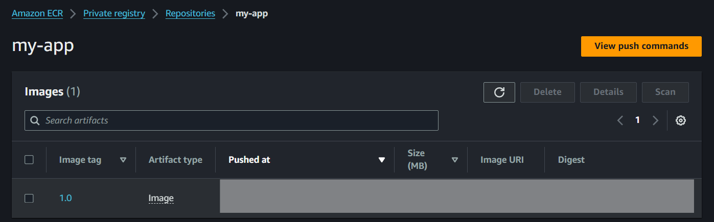
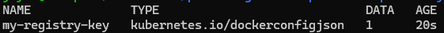
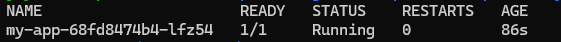
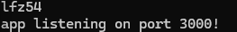

## deploy applicaion with docker image from private repository AWS ECR



- Create Kubernetes secret for ECR
    - ``` kubectl create secret generic my-registry-key --from-file=.dockerconfigjson=/home/jayce/.docker/config.json --type=kubernetes.io/dockerconfigjson ```
    - ``` kubectl get secret ```

    

- Create configuration file with created secret key

- Deploy the application

    
    
    